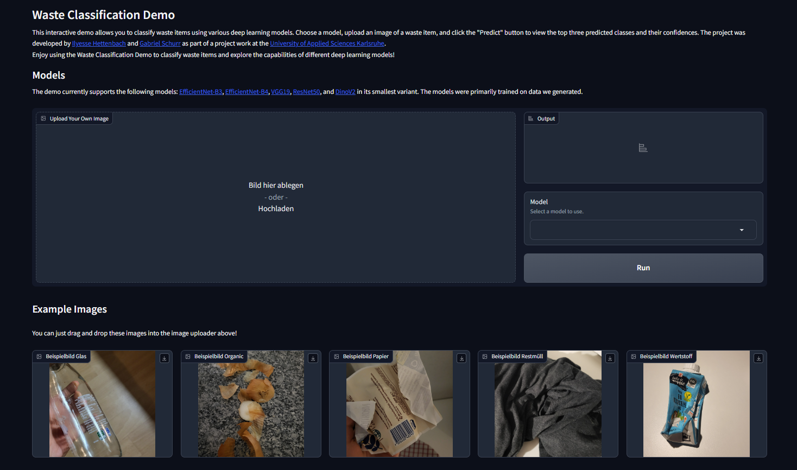

## Gradio app for a waste classification project 

Project work at the [University of Applied Sciences Karlsruhe](https://www.h-ka.de/) by Ilyesse Hettenbach and Gabriel Schurr.



To run the app as a [docker](https://www.docker.com/) container:

1. Open path of project in cmd

2. Type in ```docker build . -t waste-gradio-app:latest```. This will create a docker image with the name waste-gradio-app and version latest. It can take a while, because it has to download all the dependencies for python.

3. Then just type in ```docker run --rm -p 7860:7860 -e GRADIO_SERVER_NAME=0.0.0.0 waste-gradio-app:latest```. This will run the docker image and you can access the app via [localhost:7860](http://localhost:7860/) in your browser.

Alternative create a virtual venv and install the dependencies from the requirements.txt file. Then run the app.py file.
